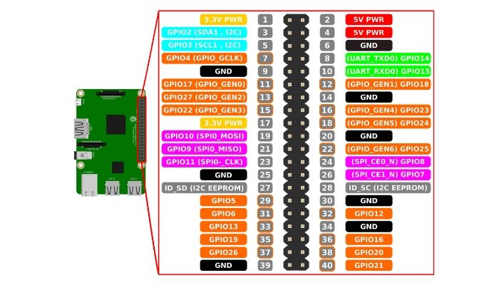
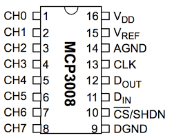
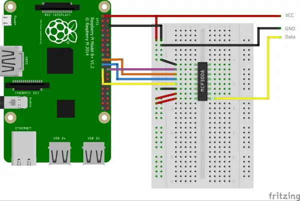

# praum-monitor

<!-- TOC -->

- [praum-monitor](#praum-monitor)
  - [Readings](#readings)
  - [GPIOs](#gpios)
    - [Connecting RaspberryPi and MCP3008](#connecting-raspberrypi-and-mcp3008)
    - [GPIO distribution](#gpio-distribution)
  - [Operations](#operations)
    - [Install samba](#install-samba)
  - [Disable display sleep](#disable-display-sleep)
  - [Install Firefox](#install-firefox)
  - [Autostart Firefox](#autostart-firefox)
  - [Hide taskbar / menubar](#hide-taskbar--menubar)
  - [Make the mouse disappear](#make-the-mouse-disappear)
  - [Development](#development)
    - [dev-server](#dev-server)

<!-- TOC -->

## Project

| App             | Description                                                 |
| --------------- | ----------------------------------------------------------- |
| `praum-monitor` | Reads sensors and provides an api.                          |
| `web-app`       | Electron web app using Chart.js to present the sensor data. |

## Readings

MQ-4

- CH4 (Methan)
- LPG (Liquefied Petroleum Gas)
- H2 (Hydrogen)
- SMOKE
- ALCOHOL
- CO (Carbon monoxide)

MQ-135

- ACETON
- TOLUENO
- ALCOHOL
- CO2 (Carbon dioxide)
- NH4 (Ammonium)
- CO (Carbon monoxide)

Sound Sensor
Analoge werte von 0 1024.

Motion Sensor

## GPIOs





### Connecting RaspberryPi and MCP3008



### GPIO distribution

| RaspberryPi Pin  | MCP3008 Pin      | Device                  |
| ---------------- | ---------------- | ----------------------- |
| Pin 1 (3.3V)     | Pin 16 (VDD)     |                         |
| Pin 1 (3.3V)     | Pin 15 (VREF)    |                         |
| Pin 6 (GND)      | Pin 14 (AGND)    |                         |
| Pin 23 (SCLK)    | Pin 13 (CLK)     |                         |
| Pin 21 (MISO)    | Pin 12 (DOUT)    |                         |
| Pin 19 (MOSI)    | Pin 11 (DIN)     |                         |
| Pin 24 (CE0)     | Pin 10 (CS/SHDN) |                         |
| Pin 6 (GND)      | Pin 9 (DGND)     |                         |
|                  | CH5              | MQ-135 (AO)             |
|                  | CH7              | MQ-4 (AO)               |
|                  | CH3              | Sound Sensor V2 (A0)    |
| Pin 4 / 5V       |                  | Sound Sensor V2 VCC     |
| Pin 34           |                  | Sound Sensor V2 GND     |
|                  |                  |                         |
| Pin 11 / GPIO 17 |                  | traffic light l Green   |
| Pin 13 / GPIO 27 |                  | traffic light l Yellow  |
| Pin 15 / GPIO 22 |                  | traffic light l Red     |
|                  |                  | traffic light l GND     |
| Pin 36 / GPIO 16 |                  | traffic light c Green   |
| Pin 38 / GPIO 20 |                  | traffic light c Yellow  |
| Pin 40 / GPIO 21 |                  | traffic light c Red     |
|                  |                  | traffic light c GND     |
| Pin 37 / GPIO 26 |                  | traffic light r Green   |
| Pin 35 / GPIO 19 |                  | traffic light r Yellow  |
| Pin 33 / GPIO 13 |                  | traffic light r Red     |
|                  |                  | traffic light r GND     |
| Pin 29 / GPIO 5  |                  | Piezo SIG               |
| Pin 31 / GPIO 6  |                  | Buzzer SIG              |
| Pin 7 / GPIO 4   |                  | Movement Sen Out        |
| Pin 39           |                  | Movement Sen GND        |
| Pin 4            |                  | Movement Sen VCC (5V)   |
| Pin 32 / GPIO 12 |                  | Climate Sensor Out      |
| Pin 30           |                  | Climate Sensor GND      |
| Pin 2            |                  | Climate Sensor VCC (5V) |

## Development

### dev-server

Start a local http server for development with.

```bash
python3 dev-server.py
```

## Installation

### Installation script ([script 📃](bin/install.sh))

> Be careful using this scripts. Always check content before running a script with `sudo`.

```bash
sudo /bin/bash -c "$(curl -fsSL https://raw.githubusercontent.com/lukasdanckwerth/praum-monitor/main/bin/install.sh)"
```

### Update and install packages

```bash
sudo apt-get update --assume-yes && \
sudo apt-get upgrade --assume-yes && \
sudo apt-get install --assume-yes vim git && \
sudo apt-get install --assume-yes python-dev
```

Expand file system `"Advanced Options"` -> `"Expand Filesystem"` and activate SPI with `"Interface Options"` -> `"SPI"`.

```bash
sudo raspi-config

# or expand filesystem with
sudo raspi-config --expand-rootfs

# and enable spi interface
sudo raspi-config nonint do_spi 0
```

### Install samba

```bash
sudo apt-get install --assume-yes samba samba-common-bin
sudo smbpasswd -a pi
# user: pi
# password: pi
sudo vim /etc/samba/smb.conf
sudo mkdir /srv/praum-monitor
sudo chown pi:pi /srv/praum-monitor
sudo chmod 777 /srv/praum-monitor
```

See [smb.conf](assets/smb.config).

### Install py-spidev lib

```bash
pushd /srv/
wget https://github.com/doceme/py-spidev/archive/master.zip -O py-spidev.zip
unzip py-spidev.zip
cd py-spidev-master
sudo python3 setup.py install
popd
```

## Disable display sleep

```bash
# to avoid a `unable to open display` error use the following
export DISPLAY=:0

# set screen saver timeout to zero:
xset s 0

# set dpms (EnergyStar) to disabled:
xset -dpms

# verify your settings with
xset q
```

## Autostart Firefox

Edit:

```bash
sudo vim /etc/xdg/lxsession/LXDE-pi/autostart
```

## Hide taskbar / menubar

Edit `/etc/xdg/lxsession/LXDE-pi/autostart`

```bash
sudo vim /etc/xdg/lxsession/LXDE-pi/autostart
```

Comment the following line.

```bash
@lxpanel --profile LXDE
```

```bash
@lxpanel --profile LXDE-pi
@pcmanfm --desktop --profile LXDE-pi
@xscreensaver -no-splash
@unclutter -idle 0.1 -root
@bash /srv/praum-monitor/bin/start-web-app.sh
#@firefox-esr --kiosk --private-window file:///home/pi/Desktop/index.html
```

## Make the mouse disappear

To make the mouse disappear first install _unclutter_:

```bash
sudo apt-get install unclutter
```

Then add the following line to your `/etc/xdg/lxsession/LXDE-pi/autostart` file.

```bash
@unclutter -idle 0.1 -root
```
